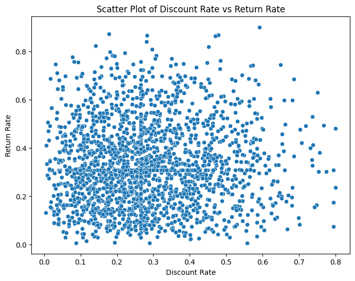
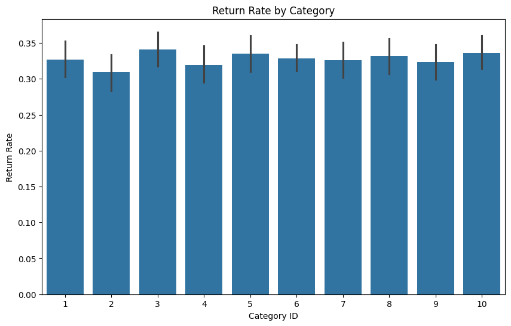

# 📦 Smart E-Commerce Revenue Insights  
### _Reducing Returns. Boosting Profitability. Data That Drives Retail Decisions._

---

## 🚀 Project Objective: Unlock Business Value from E-Commerce Data

This project analyzes a real-world **E-Commerce Product Performance** dataset to uncover **data-driven insights** around:

- 🔍 Pricing & Discounts  
- 🔁 Product Returns  
- ⭐ Customer Ratings & Reviews  
- 🚚 Delivery Timelines  
- 📦 Stock Availability  

Using **Python**, **EDA**, and **visual analytics**, this analysis supports smarter decision-making for e-commerce platforms like **Amazon**, **Walmart**, and **Flipkart**.

---

## 📊 Key Business Goals & Deliverables

✅ Cleaned, structured, and analyzed data to support:

- 💸 **Optimized Pricing** – Identify discount thresholds that boost sales without increasing returns  
- 🔁 **Return Reduction** – Detect high-return categories and customer dissatisfaction triggers  
- 📦 **Inventory Management** – Prioritize stock for high-performing, low-return SKUs  
- 🚚 **Operational Efficiency** – Highlight delivery and availability gaps that impact revenue  
- ⭐ **Customer Trust** – Correlate review volume and rating with product success  

---

## 📊 Visual Highlights

### 🔁 Return Rate vs Discount Rate  
_Higher discounts (>40%) are associated with increased return rates._



---

### 📉 Return Rate by Product Category  
_Categories like 3, 5, and 10 consistently show high return rates._



---


## 🧠 Business Questions Answered

### 1️⃣ Which pricing and discount strategies reduce return rates and maximize revenue?
- 📉 Discounts above 40% tend to increase return rates, especially on low-rated products  
- ✅ Moderate discounts + high ratings = the sweet spot for profit  

---

### 2️⃣ Which product categories are the worst performers in terms of return volume?
- 🔴 Categories 3, 5, and 10 show consistently high return ratios  
- 📊 Category-level strategy is needed to limit loss from returns  

---

### 3️⃣ Do stock decisions align with customer satisfaction?
- 📦 Even poorly rated products remain stocked — wasting inventory and shelf space  
- ✅ Prioritize stocking based on product performance and satisfaction metrics  

---

## 📁 Dataset Summary: Real-World E-Commerce Attributes

| Column               | Description |
|----------------------|-------------|
| `Product_Price`      | Price in USD (up to $1000) |
| `Discount_Rate`      | Applied discount (0–80%) |
| `Product_Rating`     | Avg. customer star rating |
| `Number_of_Reviews`  | Volume of feedback |
| `Stock_Availability` | 1 = In stock, 0 = Out of stock |
| `Days_to_Deliver`    | Delivery timeline |
| `Return_Rate`        | Ratio of returned orders |
| `Category_ID`        | Categorical product grouping |

**📌 Source:** Kaggle – *E-Commerce Product Performance Dataset*  
**📅 Time Range:** Snapshot data

---

## 🛠 Tools, Languages & Libraries Used

- **Python** – Data wrangling & analysis  
- **Pandas, NumPy** – Data preprocessing  
- **Matplotlib, Seaborn** – Data visualization  
- **Plotly** – Optional interactive charts  
- **Power BI / Tableau** – Optional dashboard layer  

---

## 🧾 Project Structure

```bash
Smart-Ecommerce-Revenue-Insights/
├── E_commerce.ipynb                # Main analysis notebook
├── README.md                       # This documentation file
└── images/
    ├── Unknown-2.png               # Return vs Discount plot
    ├── Unknown-5.png               # Rating by Stock Availability
    └── Unknown-6.png               # Return Rate by Category
